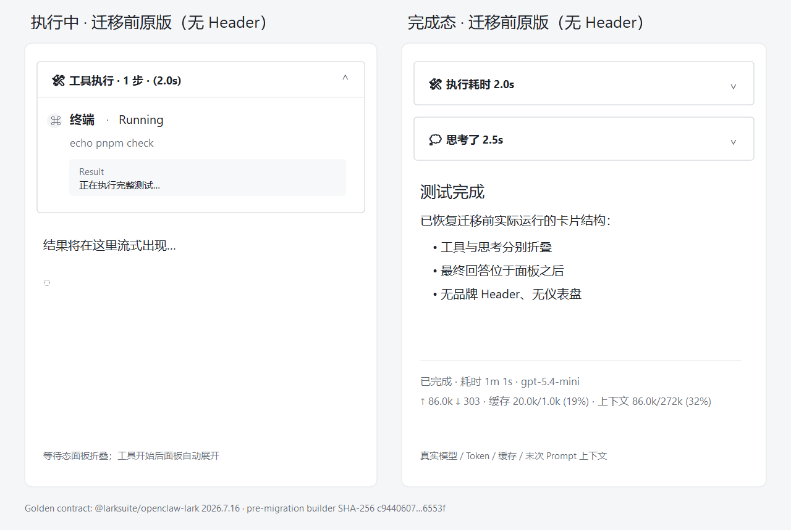

# Feishu CardKit for OpenClaw and Hermes

A hybrid repository with two native integrations and one official CLI verification transport:

- A TypeScript OpenClaw plugin that registers a version-pinned official Feishu channel, enriches its channel-owned streaming card lifecycle, and retains public reply hooks for routed text delivery.
- A Python Hermes platform plugin extending Hermes' native `FeishuAdapter`.
- A `larksuite/cli` raw-API adapter for structured CardKit dry-runs and live lifecycle smoke tests.

The default card preserves the exact official builder that was running in WSL before migration. It has no added header: the waiting tool panel is collapsed, the active tool panel expands, and a completed reply renders the collapsed tool panel, collapsed reasoning panel, final answer, then the original two-line footer. The footer shows status, elapsed time, actual model, tokens, cache, and context. Provider, cost, reasoning mode, resource, and aggregate metrics remain available internally and only enter diagnostics when explicitly enabled.

The always-visible two-line footer shows status, elapsed time, the actual model,
turn tokens, cache usage, and final-call prompt occupancy. Requested-versus-resolved
routing, cost, and reasoning metadata stay in runtime metrics. Host resources,
local ledger totals, background tasks, and cached balances are opt-in diagnostics
so incomplete data is not presented as an authoritative provider account total.



## Quick start

```bash
corepack enable 2>/dev/null || npm install --global pnpm@11.18.0
pnpm install --frozen-lockfile
pnpm check

python -m venv .venv
source .venv/bin/activate
pip install -e '.[hermes,dev]'
ruff check .
pytest
```

OpenClaw:

```bash
pnpm build
openclaw plugins install --link .
openclaw plugins disable openclaw-lark
openclaw plugins enable openclaw-hermes-feishu-card
pnpm run doctor -- --runtime
```

Official lark-cli CardKit probe:

```bash
bash scripts/install-wsl.sh --lark-cli
pnpm build
pnpm card:smoke:lark-cli
pnpm card:smoke:lark-cli -- --live --chat-id oc_xxx
```

Hermes:

```bash
hermes plugins install wzgrx/openclaw-hermes-feishu-card --enable
HERMES_BIN="$(readlink -f "$(command -v hermes)")"
HERMES_PYTHON="$(dirname "$HERMES_BIN")/python"
"$HERMES_PYTHON" -m pip install -e ~/.hermes/plugins/feishu-platform
```

For a local WSL checkout, install both integrations with:

```bash
bash scripts/install-wsl.sh --all --restart
```

See [configuration](docs/configuration.md), [architecture](docs/architecture.md),
[compatibility](docs/compatibility.md), [maintenance](docs/maintenance.md), and
[migration](docs/migration.md).

## Principles

- The user's global `openclaw-lark` installation stays untouched. The pinned dependency's published CommonJS source entry is normalized in a private runtime copy; card enrichment itself is an in-memory wrapper.
- Monotonic CardKit sequences and explicit finalization.
- Fail-open delivery: native text remains active when card delivery fails.
- Append-only NDJSON usage storage shared across runtimes.
- Credentials are resolved from the host configuration or environment.
- Runtime diagnostics use structured output and lark-cli dry-runs; secrets are passed only through the child-process environment.

## License

MIT
