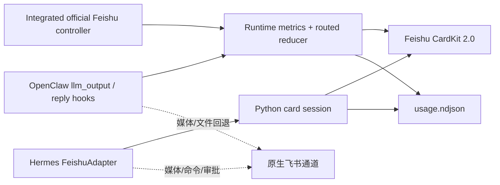

# 架构

## 总览



## OpenClaw 路径

1. 插件在内存中加载并注册锁定版本的官方 `@larksuite/openclaw-lark`；独立的同名插件条目保持禁用，避免重复注册 `feishu` 通道。
2. 官方 controller 继续负责 WebSocket 入站、流式卡片创建、工具/思考面板、线程回复、媒体和终态关闭。
3. `llm_output` 按 `sessionKey + runId` 累加每次模型调用，并保留末次调用的真实上下文占用；`agent_end` 补充整轮耗时。
4. controller 读取内存中的本轮快照，不再依赖旧版 `sessions.json` 文件位置。
5. 终态 builder 保留官方工具、思考和回答布局，增加品牌 Header，并输出紧凑三行 Footer。
6. `reply_payload_sending` 继续处理非通道直派、重定向等普通文本路径；CardKit 成功后才取消原负载。

普通 `text` 以及只含 `text/context/divider` 的通用 `presentation` 可进入路由型
CardKit bridge；带按钮、选择器、置顶请求、媒体或显式飞书卡片的负载继续交给
官方通道，避免破坏交互语义。飞书群聊的正常入站回答走上面的集成 controller。

## Hermes 路径

Hermes 已原生支持 Feishu/Lark，因此本项目不再运行独立 WebSocket sidecar。

1. 用户插件以 `feishu-platform` 身份覆盖平台注册项。
2. `HermesFeishuCardAdapter` 继承原生 `FeishuAdapter`。
3. Hermes 的 `GatewayStreamConsumer` 继续调用 `send()` / `edit_message()`。
4. `format_tool_event()` 把结构化工具事件编码为内部标记；适配器将标记并入同一张卡片。
5. `pre_api_request` 按 `turn_id` 开启新一轮；`post_api_request` 汇总标准化
   Token 使用量，并根据最终模型响应识别整轮结束；`api_request_error`
   标记耗尽重试后的失败终态。
6. Hermes 在工具边界也会传入 `finalize=True`。插件只在生命周期 Hook
   确认整轮结束后关闭卡片，避免工具前置文本提前终结 CardKit 流。
7. 附件、语音、审批与其他富媒体负载继续调用父适配器。

## 状态与顺序

每张卡片维护：

- 运行时、会话、聊天、回复锚点
- `running/completed/failed/aborted`
- 首 Token、开始、结束时间
- 回答、思考摘要、工具列表
- CardKit `card_id`、消息 ID、严格递增 `sequence`
- 模型、Provider、Token、缓存、上下文和费用

OpenClaw 运行数据按以下优先级归一化：

- 供应商/模型：使用 `resolvedRef` 的实际胜出路由；`requested` 单独保存，
  仅在回退或路由变化时显示。
- 上下文占用：`contextUsedTokens` → 末次调用的
  `input + cacheRead + cacheWrite` → 本轮累计 Prompt。最后一种会标记“估算”。
- Token：`usage` 表示本轮多调用累计，`lastUsage` 表示末次模型调用，二者不混用。
- 耗时/费用：优先采用运行时上报的 `durationMs` / `turnUsd`；本地定价只在
  运行时没有上报费用时生效。

## 账本

账本采用追加式 NDJSON：

```json
{
  "schemaVersion": 1,
  "id": "hermes-...",
  "runtime": "hermes",
  "timestamp": 1785,
  "usage": { "totalTokens": 123, "turnCost": 0.01, "currency": "USD" }
}
```

两端写入同一个版本化格式，并兼容读取旧版扁平记录和 Python
snake_case 记录。账本按事件 ID 去重、按配置时区实时计算今日、本月和
累计值；部署时建议让两个运行时使用同一 Linux 文件路径。

## 故障隔离

- OpenClaw：集成通道保留官方错误处理；路由型 CardKit bridge 投递失败时不取消原负载。
- Hermes：CardKit 调用失败时，回答回到父类文本发送；工具事件回到简短文本提示。
- GPU/主机资源采样属于展示增强，不参与回答投递判定。
