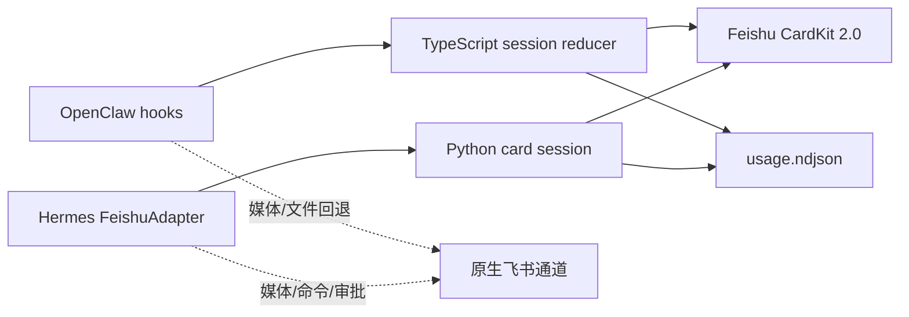

# 架构

## 总览



## OpenClaw 路径

1. `message_received` 建立运行、会话、飞书会话的路由关系。
2. `before_tool_call` / `after_tool_call` 更新工具状态。
3. `reply_payload_sending` 接收 `tool`、`block`、`final` 文本和 `usageState`。
4. 首次投递创建 CardKit 实体并把 `card_id` 作为互动消息发送。
5. 后续投递通过 `PUT /cardkit/v1/cards/:card_id` 更新卡片。
6. 终态通过 settings API 关闭流式模式。
7. 只有 CardKit 投递成功后才取消上游文本负载。

## Hermes 路径

Hermes 已原生支持 Feishu/Lark，因此本项目不再运行独立 WebSocket sidecar。

1. 用户插件以 `feishu-platform` 身份覆盖平台注册项。
2. `HermesFeishuCardAdapter` 继承原生 `FeishuAdapter`。
3. Hermes 的 `GatewayStreamConsumer` 继续调用 `send()` / `edit_message()`。
4. `format_tool_event()` 把结构化工具事件编码为内部标记；适配器将标记并入同一张卡片。
5. `pre_api_request` 按 `turn_id` 开启新一轮；`post_api_request` 汇总标准化
   Token 使用量，并根据最终模型响应识别整轮结束；`api_request_error`
   标记耗尽重试后的失败终态。
6. Hermes 在工具边界也会传入 `finalize=True`。插件只在生命周期 Hook
   确认整轮结束后关闭卡片，避免工具前置文本提前终结 CardKit 流。
7. 附件、语音、审批与其他富媒体负载继续调用父适配器。

## 状态与顺序

每张卡片维护：

- 运行时、会话、聊天、回复锚点
- `running/completed/failed/aborted`
- 首 Token、开始、结束时间
- 回答、思考摘要、工具列表
- CardKit `card_id`、消息 ID、严格递增 `sequence`
- 模型、Provider、Token、缓存、上下文和费用

## 账本

账本采用追加式 NDJSON：

```json
{
  "schemaVersion": 1,
  "id": "hermes-...",
  "runtime": "hermes",
  "timestamp": 1785,
  "usage": { "totalTokens": 123, "turnCost": 0.01, "currency": "USD" }
}
```

两端写入同一个版本化格式，并兼容读取旧版扁平记录和 Python
snake_case 记录。账本按事件 ID 去重、按配置时区实时计算今日、本月和
累计值；部署时建议让两个运行时使用同一 Linux 文件路径。

## 故障隔离

- OpenClaw：凭据解析或 CardKit 调用失败时，不取消原生负载。
- Hermes：CardKit 调用失败时，回答回到父类文本发送；工具事件回到简短文本提示。
- GPU/主机资源采样属于展示增强，不参与回答投递判定。
